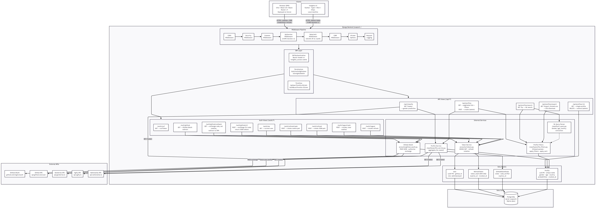

# Insighta Labs+ — profiles API (HNG Stage 1–3)

Django + Django REST Framework: **`Profile`** model (UUID v7), PostgreSQL or SQLite, **GitHub OAuth + JWT** (Bearer or **http-only cookies**), **RBAC**, **CSRF** for browser writes, rule-based natural-language search (no LLMs), **CSV export**, and **rate limits**.

Companion clients (same API & permissions):

- **Web portal:** [github.com/Trojanhorse7/insighta-frontend](https://github.com/Trojanhorse7/insighta-frontend)
- **CLI:** [github.com/Trojanhorse7/insighta-cli](https://github.com/Trojanhorse7/insighta-cli)

---

## Architecture

### System Architecture



### Browser Authentication Flow


### CLI Authentication Flow


### Profile CRUD & Data Flow


### Request Lifecycle


---

## Setup

```bash
python -m venv .venv
source .venv/bin/activate   # Windows: .venv\Scripts\activate
pip install -r requirements.txt
```

Copy [`.env.example`](.env.example) to `.env` and set at least **`DJANGO_SECRET_KEY`** (use a long random value; optional **`JWT_SIGNING_KEY`** for HS256). Set **`GITHUB_CLIENT_ID`** / **`GITHUB_CLIENT_SECRET`**, **`BACKEND_PUBLIC_URL`**, and **`WEB_PORTAL_ORIGIN`** for OAuth redirects and CORS/CSRF.

```bash
python manage.py migrate
python manage.py createcachetable django_cache   # PostgreSQL only — Django DB cache table for shared query-result cache + DRF throttle keys
python manage.py seed_profiles   # optional; reads seed_profiles.json
python manage.py runserver 0.0.0.0:8000
```

One-off **admin** by GitHub login (`User.username`):  
`python manage.py set_user_role <github_username>` (optional `--role analyst`; default role is **admin**).

`DATABASE_URL` selects Postgres; if unset, **`db.sqlite3`** in the project root is used.

**`seed_profiles`:** re-running **updates** rows by unique `name`. Batching: `SEED_POSTGRES_BATCH` (default **250**), or `python manage.py seed_profiles --batch 500`.

---

## Authentication & security

| Mechanism | Notes |
|-----------|--------|
| **API version** | All **`/api/*`** requests must send **`X-API-Version: 1`** or the API returns **400** (`API version header required`). |
| **JWT access** | `Authorization: Bearer <jwt>` **or** http-only cookie **`insighta_access`**. Never expose tokens to frontend JS except via cookie (portal uses cookies only). |
| **Refresh (CLI / scripts)** | **`POST /auth/refresh`** JSON body: `{ "refresh_token": "<opaque>" }` — **CSRF-exempt** (machine clients). |
| **Refresh (browser)** | **`POST /auth/refresh/web`** — reads **`insighta_refresh`** http-only cookie; **CSRF required** (`X-CSRFToken` + `csrftoken` cookie). Rotates and sets new cookies. |
| **Logout (browser)** | **`POST /auth/logout/web`** — CSRF required; revokes refresh and clears cookies. |
| **CSRF bootstrap** | **`GET /auth/csrf`** — ensures **`csrftoken`** is set for SPA clients. |
| **Current user** | **`GET /auth/me`** or **`GET /api/users/me`** (same response; **`/api/*`** requires **`X-API-Version: 1`**) — JWT required; returns `id`, `username`, `email`, `role`, `avatar_url`, `github_id`, `is_active`. |

**GitHub OAuth (browser):**

1. **`GET /auth/github`** — starts PKCE flow using **`GITHUB_CLIENT_ID`**; GitHub redirects to **`{BACKEND_PUBLIC_URL}/auth/github/callback`**.
2. The API exchanges the code with **`GITHUB_CLIENT_ID`** / **`GITHUB_CLIENT_SECRET`** and sets **`insighta_access`** / **`insighta_refresh`** (http-only), then redirects to **`WEB_PORTAL_ORIGIN`**.

**CLI OAuth (separate GitHub OAuth App):**

Register a **second** OAuth App for **`insighta-cli`**. Its **Authorization callback URL** on GitHub must be exactly **`INSIGHTA_CLI_OAUTH_REDIRECT`** (default **`http://127.0.0.1:8765/callback`** — GitHub redirects **directly** to the CLI listener).

1. **`GITHUB_CLI_CLIENT_ID`** + **`GITHUB_CLI_CLIENT_SECRET`** — required on the API. **`POST /auth/github/cli`** exchanges codes using these credentials only.
2. The CLI opens GitHub with the **CLI** client id and `redirect_uri` = that same loopback URL. After approval, GitHub sends `?code=` to the local server; the CLI **`POST /auth/github/cli`** with `code`, `code_verifier`, and **`redirect_uri`** (must match **`INSIGHTA_CLI_OAUTH_REDIRECT`** server-side).

The portal callback **`/auth/github/callback`** is **only** for the browser OAuth app; unknown `state` there redirects to the portal with an error (no CLI forwarding).

**RBAC:**

- **Analyst:** `GET` profiles, classify, search, export.
- **Admin:** same, plus **`POST /api/profiles`**, **`POST /api/profiles/import`** (CSV bulk), and **`DELETE /api/profiles/{uuid}`** (`UserRole.ADMIN`).

---

## CORS & CSRF

Browser clients that send **cookies** need aligned origins:

- **`CORS_ALLOWED_ORIGINS`** is built from **`WEB_PORTAL_ORIGIN`**, common Vite URLs, and optional comma-separated **`CORS_EXTRA_ORIGINS`**.
- **`CORS_ALLOW_CREDENTIALS = True`** (not `Access-Control-Allow-Origin: *` with credentials).
- **`CSRF_TRUSTED_ORIGINS`** matches the same portal origins for cross-origin **`POST`** with cookies.

Machine clients (CLI, curl with Bearer) are unaffected by CORS.

---

## Rate limiting & logging

Limits are enforced in **two places** so `/api/*` can be keyed **after** JWT authentication:

| Scope | Mechanism | Key | Budget |
|--------|-----------|-----|--------|
| **`/api/*`** (DRF) | `DEFAULT_THROTTLE_CLASSES` uses `accounts.throttles.ApiUserThrottle` | Authenticated: **`user.pk`**; otherwise client IP | **60/min** |
| **`GET/POST /auth/me`**, **`POST /auth/refresh`**, **`POST /auth/logout`**, **`POST /auth/github/cli`** | `AuthBurstThrottle` on those views | Client IP | **10/min** |
| **Other `/auth/*`** (e.g. **`/auth/csrf`**, **`/auth/github`**, **`/auth/refresh/web`**, **`/auth/logout/web`**) | `RateLimitMiddleware` (`accounts.rate_limit_middleware`) | Client IP | **10/min** |
| **`/auth/github/callback`** | (no middleware IP bucket) | — | OAuth redirect bursts |

Implementation notes:

- Middleware **does not** throttle `/api/*` (JWT is applied inside DRF, not before middleware runs).
- **`GET /auth/github/callback`** is **skipped** by the middleware IP limiter (other **`/auth/github`** traffic is still **10/min** per IP).
- DRF burst auth endpoints are **skipped** in middleware so they are not **double-counted**.
- Throttle scope names: `api_user`, `auth_burst` (see `REST_FRAMEWORK["DEFAULT_THROTTLE_RATES"]` in `config/settings.py`).

**429** responses:

- From **middleware**: `{ "status": "error", "message": "Too many requests" }`.
- From **DRF throttles**: same envelope via `accounts.exception_handlers.insighta_exception_handler` (message describes the throttle).

The **`/auth/*` IP limiter** stays in-process (`RateLimitMiddleware`). **`/api/*` DRF throttles** use Django’s default cache: **`DatabaseCache`** on PostgreSQL (shared across workers; same table as query cache) or **`LocMemCache` per process on SQLite.**

**Request logging:** method, path, status, duration, and user id (when resolved) at **INFO** on `accounts.rate_limit_middleware` (`RequestLoggingMiddleware`).

---

## API endpoints (profiles & classify)

Send **`X-API-Version: 1`** on every **`/api/*`** call. Authenticate with **Bearer** or session cookies.

### `GET /api/classify?name=...`

Genderize-backed classification (legacy shape).

### `GET /api/profiles`

List with **filters**, **sort**, **pagination**; optional **`total_pages`** and **`links`** (`self`, `next`, `prev`). PostgreSQL deployments cache successful list payloads in **`DatabaseCache`** (see `config/settings.py`; run **`createcachetable django_cache`**).

Query parameters: same as before (`gender`, `age_group`, `country_id`, `min_age`, `max_age`, `min_gender_probability`, `min_country_probability`, `sort_by`, `order`, `page`, `limit` ≤ 50). Unknown keys return **422**.

### `GET /api/profiles/export?export_format=csv&...`

Routes live in **`classify/urls.py`**.

Use **`export_format=csv`**, not `format=csv` — Django REST Framework reserves **`?format=`** for response negotiation (`json`, `api`, …) and **`?format=csv`** returns **404** before this view runs.

Streaming CSV with the **same filter/sort parameters** as list (no pagination). Filename includes timestamp.

### `GET /api/profiles/search?q=...&page=...&limit=...`

Rule-based NL parser on `q`; same list payload shape as **`GET /api/profiles`** (also cacheable on Postgres under the same semantics). Uninterpretable query returns **422** (`Unable to interpret query`).

### `GET /api/profiles/{uuid}`

Single profile.

### `POST /api/profiles`

**Admin only.** Body: `{ "name": "..." }`. Duplicate `name` returns existing profile **200**. Successful creates bump the cache generation so stale list/search pages refresh.

### `POST /api/profiles/import`

**Admin only.** `multipart/form-data` with **`file`** = UTF-8 CSV. Header must contain the profile columns (**`name`, `gender`, `gender_probability`, `age`, `age_group`, `country_id`, `country_name`, `country_probability`**). Optional **`id`** / **`created_at`** columns from our export format are skipped by name.

Processes the file in a streaming CSV reader (`TextIOWrapper` over the upload) and persists rows in **`bulk_create` batches** (default **2000**). Rows are validated per field; skipped rows populate a **`reasons`** map (**`duplicate_name`, `invalid_age`, `missing_fields`, `malformed_row`, …). Partial success does not roll back already committed batches. Ends with **`{ "status", "total_rows", "inserted", "skipped", "reasons" }`**.

Large uploads default to **≤200 MB** request bodies (`DATA_UPLOAD_MAX_MEMORY_SIZE`); override via env if your host permits.


### `DELETE /api/profiles/{uuid}`

**Admin only.** **204** on success.

---

## Natural language parser

Implementation: `classify/nl_query.py` (countries: `classify/country_data.py`). Behaviour summarized below (unchanged in spirit from Stage 1).

1. **Normalize** the query: trim, lowercase, strip accents, replace punctuation with spaces, collapse whitespace.
2. **Countries**: longest-match against the **65** seed country names with **word boundaries** (`(?<!\w)…(?!\w)` on normalized tokens).
3. **Both genders**: phrases like `male and female` remove a single-gender filter; other cues still apply.
4. **One gender**: `male`/`men`/… map to `male`; `female`/… map to `female`.
5. **Age group words**: `child`/`teenager`/`adult`/`senior`/`elderly` set `age_group`; conflicting groups yield unable to interpret.
6. **“young”**: ages **16–24**; intersects with explicit `min_age` / `max_age` if present.
7. **Numeric age**: `above N`, `below N`, etc. as documented previously in this section.
8. Filler words (`people`, `from`, `in`, …) optional if other cues exist.

### Supported examples (illustrative)

| Query (idea) | Parsed filters (conceptually) |
|--------------|--------------------------------|
| young males from nigeria | `gender=male`, `min_age=16`, `max_age=24`, `country_id=NG` |
| females above 30 | `gender=female`, `min_age=30` |
| people from angola | `country_id=AO` |
| adult males from kenya | `age_group=adult`, `gender=male`, `country_id=KE` |
| male and female teenagers above 17 | `age_group=teenager`, `min_age=17` |

### Limitations (parser)

- Country vocabulary = **countries in the seed** only.
- Short/ambiguous tokens may not map; spelling/slang/negation/OR unsupported; **“young”** is fixed 16–24; no NL-driven sort.

---

## Errors

| HTTP | When |
|------|------|
| 400 | Missing API version header (`/api/*`); missing/empty parameter |
| 401 | Missing/invalid/expired JWT |
| 403 | **Forbidden** (e.g. non-admin mutation) |
| 404 | Profile not found |
| 422 | Invalid query params; NL not interpretable; invalid body types |
| 429 | Rate limit exceeded |
| 502 | Upstream failure on profile aggregation |

Body shape (typical): `{ "status": "error", "message": "<string>" }`.

---

## Environment (see `.env.example`)

| Variable | Role |
|----------|------|
| `DJANGO_SECRET_KEY` | Django signing; use strong secret in production |
| `JWT_SIGNING_KEY` | Optional separate HS256 key for JWTs |
| `DATABASE_URL` | Postgres URL (omit for SQLite) |
| `GITHUB_CLIENT_ID` / `GITHUB_CLIENT_SECRET` | GitHub OAuth **portal** app |
| `GITHUB_CLI_CLIENT_ID` / `GITHUB_CLI_CLIENT_SECRET` | Optional GitHub OAuth **CLI** app (same callback URL as portal app; omit to use one app for both) |
| `BACKEND_PUBLIC_URL` | Public API base (OAuth callback URL) |
| `WEB_PORTAL_ORIGIN` | SPA origin (post-login redirect; CORS/CSRF) |
| `CORS_EXTRA_ORIGINS` | Optional extra allowed origins (comma-separated) |
| `INSIGHTA_CLI_OAUTH_REDIRECT` | Allowlisted **`redirect_uri`** for **`POST /auth/github/cli`**; must match the CLI OAuth App’s GitHub callback (loopback, e.g. `http://127.0.0.1:8765/callback`) |
| `ACCESS_TOKEN_LIFETIME_SECONDS` / `REFRESH_TOKEN_LIFETIME_SECONDS` | JWT access / opaque refresh lifetimes |
| `INSIGHTA_ENABLE_TEST_OAUTH_CODE` | If **`true`**, **`GET /auth/github/callback?code=test_code&state=...`** (with a valid `state` from **`GET /auth/github`**) returns JSON **`access_token`** + **`refresh_token`** for an admin user instead of redirecting. **Keep `false` in production** unless a grader requires it. |
| `INSIGHTA_TEST_OAUTH_CODE` | Literal `code` value to treat as test (default **`test_code`**). |
| `GRADER_ADMIN_USERNAME` | Optional GitHub **`username`** for that JSON response; if unset, first active **admin** by `created_at`. |
| `DEBUG` | **`false`** in production: auth/CSRF cookies use **Secure** + **SameSite=None** for cross-site SPAs. **`true`** (local dev) uses **Lax** and non-secure CSRF defaults. See `config/settings.py`. |

---

## Automated grading (`test_code`)

Some checkers call **`GET /auth/github`** then **`GET /auth/github/callback`** with a special **`code`** (default **`test_code`**) to obtain **admin** access + refresh as **JSON** (no GitHub token exchange).

1. Ensure at least one **`User`** with **`role=admin`** exists (sign in once, then `set_user_role` if needed).
2. Set **`INSIGHTA_ENABLE_TEST_OAUTH_CODE=true`** and redeploy. Optionally set **`GRADER_ADMIN_USERNAME`** to pin which admin receives tokens.
3. If the checker sends **`code_verifier`** in the query, it must match the verifier stored for that **`state`**.

**Analyst token** is still supplied separately (paste into the form or run **`python manage.py issue_tokens <analyst_username>`** on the server).

**Option B — paste only:** leave **`INSIGHTA_ENABLE_TEST_OAUTH_CODE`** unset/false and paste tokens from **`issue_tokens`** for admin (access + refresh) and analyst (access).

**Rate limits:** **`GET /auth/github`** and **`GET /auth/github/callback`** are excluded from the middleware’s 10/min per-IP bucket so automated checks do not get **429** on the OAuth start URL.

---

## CI

GitHub Actions: [`.github/workflows/ci.yml`](.github/workflows/ci.yml) runs on **`master`** for **push** and **pull_request**: **SQLite** job (migrate, `check`, `test`) and **PostgreSQL 16** job (`DATABASE_URL` + `test`). Commit and push `.github/` to the repo GitHub inspects.

---

## Key source files (orientation)

| Area | Location |
|------|-----------|
| JWT + OAuth views, cookies | `accounts/views.py` |
| JWT authentication | `accounts/authentication.py` |
| RBAC permissions | `accounts/permissions.py` |
| API rate throttles (DRF) | `accounts/throttles.py` |
| Rate limit middleware + request logging | `accounts/rate_limit_middleware.py` |
| DRF error envelope | `accounts/exception_handlers.py` |
| Admin role CLI | `accounts/management/commands/set_user_role.py` |
| Print access + refresh (grader / local) | `accounts/management/commands/issue_tokens.py` |
| Root URLconf (includes only) | `config/urls.py` |
| Profiles + NL search | `classify/profile_views.py`, `classify/nl_query.py` |
| CSV export (routes in `classify/urls.py`) | `classify/export_views.py` |
| Settings (CORS, CSRF, REST_FRAMEWORK, lifetimes) | `config/settings.py` |

---

## Deploy

```bash
gunicorn config.wsgi:application --bind 0.0.0.0:$PORT
```

Use **`DEBUG=False`**, strong secrets, **`ALLOWED_HOSTS`**, **`WEB_PORTAL_ORIGIN`** / **`BACKEND_PUBLIC_URL`** as HTTPS origins, and a production **`DATABASE_URL`**. Ensure **`CSRF_TRUSTED_ORIGINS`** and **`CORS_ALLOWED_ORIGINS`** include the real portal URL.
